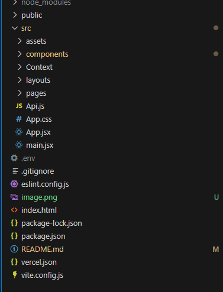
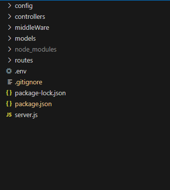

# 📋 Task Tracker App

A full-stack Task Tracker application built using **React.js** for the frontend and **Node.js** (Express) for the backend. This app allows users to manage tasks efficiently with features like task creation, updates, deletions, and status tracking.

---

## 🚀 Features

- ✅ User Authentication (Register & Login)
- 📅 Create, Update, Delete, and View Tasks
- 🏷️ Assign priorities and due dates
- 🔍 Search and filter tasks
- 📊 Dashboard with task statistics
- 🧑‍🤝‍🧑 Team collaboration (if enabled)

---

## 🛠️ Tech Stack

### Frontend
- React.js (with Hooks)
- React Router
- Context API
- Tailwind CSS

### Backend
- Node.js
- Express.js
- MongoDB Database
- JWT for authentication
- Mongoose

---

## 📁 Project Structure
### Frontend Structure
  
### Backend Structure
  


---

## 🔐 Authentication Flow

1. **Registration** – A new user registers via `/api/auth/register`. The password is hashed with bcrypt.
2. **Login** – The server responds with a signed JWT.
3. **Session Management** – JWT is stored in local storage or HTTP-only cookie.
4. **Protected Routes** – Backend checks `Authorization: Bearer <token>` on private endpoints.

---

## 🚀 Getting Started


Follow the steps below to set up the **Task Tracker App** on your local machine. The project has two main parts: the **Frontend (React.js)** and the **Backend (Node.js + Express)**.

---

### 🖥️ Frontend Setup (React.js)

> Located in the `client/` folder

#### 1. Navigate to the frontend directory

```bash
cd client

```
### 2. create project with vite
```bash
   use command npm create vite@latest task_tracker

```
### 🖥️ Backend Set up(Node js+express)
 ```bash
     --create a backend folder name task_tracker_backend
     --write commandnpm init -y
     --install express, dotenv,mongoose
     --install nodemon npm install --save-dev nodemon
     -- now install all libraries mpm install
     --- create server file


 ```

## 📂 Workflow

This section describes how the application works from both the **user perspective** and the **developer perspective**.

---

### 🧭 Runtime Workflow (User Journey)

1. **🔐 User Registration & Login**
   - Users sign up or log in via `/api/auth/register` or `/api/auth/login`.
   - A JWT token is returned on successful login and stored in local storage or a cookie.

2. **🏠 Dashboard Access**
   - On login, the app fetches tasks using the JWT.
   - JWT is validated on the backend to retrieve the authenticated user's tasks.

3. **📝 Task Management**
   - Users can create, update, or delete tasks.
   - The frontend sends API requests (`POST`, `PUT`, `DELETE`) to the backend.
   - Backend processes requests, updates the database, and returns updated task data.

4. **📊 Task Display & Filtering**
   - Tasks are displayed in categorized views (e.g., Todo, In Progress, Done).
   - Users can filter or search tasks by keyword, due date, or priority.

5. **🚪 Logout**
   - JWT token is cleared from storage, and the user is redirected to the login page.

---

## ✅Future Enhancements
  - Real-time task updates (WebSockets)

  - Recurring tasks

 - Role-based access control (RBAC)

-  File attachments for tasks

-  Mobile-friendly UI


## 📌 Conclusion

The **Task Tracker App** provides a full-stack solution for managing daily tasks, improving productivity, and fostering better collaboration. With a React-based frontend and a robust Node.js backend, the app demonstrates a modular and scalable architecture suitable for both individual use and small teams.

Whether you're adding new features, customizing the UI, or deploying it for real-world use, the project is easy to extend and adapt. Contributions, feedback, and improvements are always welcome!

Happy coding! 🚀


